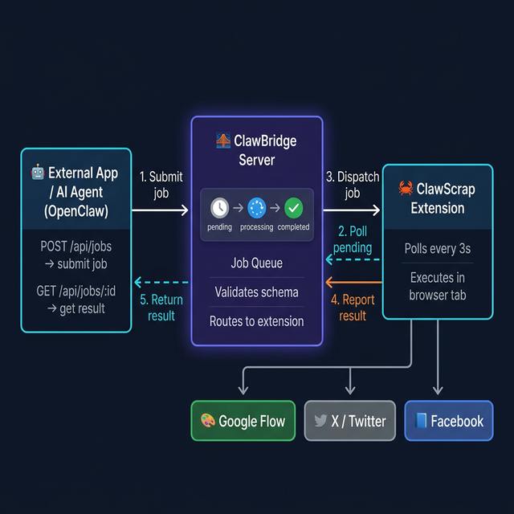

# 🦀 ClawScrap

**Browser automation extension** — A Chrome extension that connects to [ClawBridge](https://github.com/benteckxyz/clawbridge) server to automate browser tasks like AI image generation and social media posting.

---

## ✨ Supported Job Types

| Plugin | Job Type | Description |
|--------|----------|-------------|
| 🎨 **Flow Image Gen** | `flow_generate` | Generate AI images via [Google Flow](https://labs.google/fx) |
| 🐦 **Post to X** | `post_x` | Compose and post tweets with text + images |
| 📘 **Post to Facebook** | `post_facebook` | Post to personal profile or Facebook pages with media |

## 📋 Requirements

- **Google Chrome** browser
- **[ClawBridge](https://github.com/benteckxyz/clawbridge)** server running
- Accounts logged in on target websites (X, Facebook, Google Flow)

## 🚀 Setup

### 1. Start ClawBridge server

```bash
cd clawbridge
npm install
node server.js
# or with auth:
API_KEY=your-key node server.js
```

### 2. Load extension in Chrome

1. Go to `chrome://extensions/`
2. Enable **Developer mode** (top right)
3. Click **Load unpacked** → select this `clawscrap/` folder
4. 🦀 icon appears in toolbar

### 3. Connect to ClawBridge

1. Click 🦀 icon
2. Set **ClawBridge Server URL** (default: `http://localhost:3002`)
3. Set **API Key** if bridge requires auth
4. Click **▶ Connect**

Extension registers with ClawBridge and starts polling for jobs.

### 4. Open target websites

Keep tabs open for sites you want to automate:
- **Google Flow**: https://labs.google/fx/vi/tools/flow
- **X/Twitter**: https://x.com
- **Facebook**: https://www.facebook.com

> **Note:** Flow plugin triggers Chrome's debugger bar ("ClawScrap started debugging this browser") — this is normal and used for trusted keyboard input.

---

## 📁 Project Structure

```
clawscrap/
├── manifest.json          # Chrome MV3 manifest
├── background.js          # Bridge connect + plugin router + polling
├── content-flow.js        # Google Flow image gen plugin
├── content-x.js           # X/Twitter posting plugin
├── content-facebook.js    # Facebook posting plugin
├── popup.html / popup.js  # Extension popup UI
└── icons/                 # Extension icons
```

## 🔄 How It Works



### Architecture Overview

ClawScrap acts as the **browser-side worker** in a 3-layer architecture:

```
External App / AI Agent  ←→  ClawBridge Server  ←→  ClawScrap Extension  →  Browser Tabs
```

Each layer has a specific role:

| Layer | Role |
|-------|------|
| **External App** (e.g. OpenClaw) | Submits jobs via REST API, polls for results |
| **ClawBridge** | Job queue, schema validation, routing, scheduling |
| **ClawScrap** | Polls bridge, executes jobs in real browser tabs, reports results |

---

### Step-by-Step Flow

**1️⃣ Extension connects to bridge**
On startup (or Chrome boot), ClawScrap registers itself with ClawBridge:
```
POST /api/extensions/connect
{ "name": "ClawScrap", "types": ["flow_generate", "post_x", "post_facebook"] }
→ receives extensionId
```

**2️⃣ Extension polls for jobs**
Every 3 seconds, ClawScrap asks the bridge if there's pending work:
```
GET /api/jobs/pending?extensionId=<id>
→ bridge returns next pending job (or null)
```
> A Chrome Alarm keeps the service worker alive so polling continues without user interaction.

**3️⃣ Bridge dispatches job**
When a job is found, the bridge marks it `processing` and returns the full payload to the extension.

**4️⃣ Extension executes in browser tab**
ClawScrap finds the matching browser tab (e.g. x.com for `post_x`), injects a content script, and performs actions directly:

| Job Type | What it does in the browser |
|----------|-----------------------------|
| `flow_generate` | Opens Google Flow, types prompt via CDP, clicks Generate, captures image |
| `post_x` | Opens X composer, downloads + attaches media, types text, clicks Post |
| `post_facebook` | Opens Facebook composer, downloads + attaches media, types text, clicks Post |

**5️⃣ Extension reports result**
After completing (or failing), ClawScrap reports back:
```
PATCH /api/jobs/:id
{ "status": "completed", "result": { ... } }
```

**6️⃣ Caller gets result**
The external app polls `GET /api/jobs/:id` until status is `completed` and reads the result.

---

### Why Not Use OpenClaw's Browser Relay?

OpenClaw's built-in Browser Relay works by taking screenshots and sending them to a vision AI model to analyze the page and decide what to do next. This means **every action costs image tokens and adds latency**.

ClawScrap takes the opposite approach: **hardcoded browser automation** using DOM selectors and Chrome APIs. It's faster, cheaper, and more reliable — at the cost of only supporting a fixed set of job types.

| | Browser Relay | ClawScrap |
|--|--------------|-----------|
| Flexibility | ✅ Any website | ❌ Fixed job types |
| Speed | 🐢 Slow (vision AI) | ⚡ Fast (hardcoded) |
| Token cost | 💰 Image tokens per step | 🆓 Zero tokens |
| Reliability | ⚠️ May misread UI | ✅ Direct DOM control |

---

## ⚠️ Disclaimer

For educational and personal use only. Users are responsible for compliance with third-party platform Terms of Service. All actions happen locally in your browser using your own logged-in accounts.

## 📄 License

MIT
